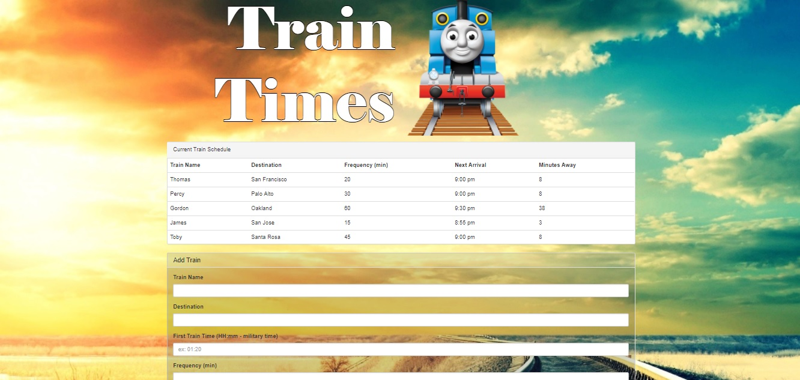

Train Schedules

This is a web app that utilizes Firebase in order to capture user input of train times and store them server side. 
The output from this form is the times until the next train based on user input.

Built With:
Firebase - To capture and store user input
Bootstrap - Framework and page layout
Moment.js - Used to generate times

Built By:
Jordan Ketring